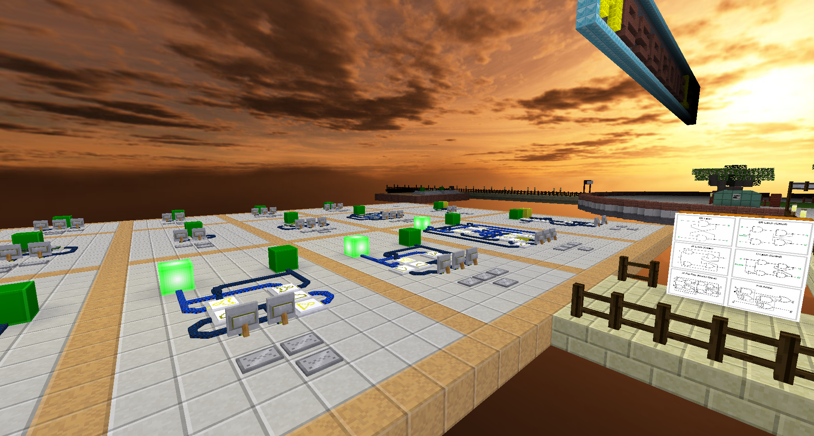

# Mesecons lab

Mesecons laboratory and tutorials

This game provides a world with prebuilt circuits and demos around the mesecons mod.

It can be used as an educational tool in singleplayer or multiplayer.

# Current state

There are various builds provided by So.Po.Coder and some basic excercises to complete.

The game isn't yet finished but playable in the current state, contributions are always welcome.



# Sources

* https://forum.minetest.net/viewtopic.php?f=12&t=24034

# Development

## Mod development

Modding on the Lua-Front:

```bash
# initialize and checkout the submodules
git submodule init
git submodule update
```

## World development

Building and changing the ingame world

Changes are writtenback with the help of the `modgen` mod:
https://github.com/BuckarooBanzay/modgen

* Add the `modgen` mod to the list of trusted mods
* Change/Improve things
* Select the opposite corners of the changed area with `/pos1` and `/pos2` (alternatively: use Worldedit markers)
* Export it back with `/export` or `/export fast` if you are in a hurry
* Add and commit the changes in git

# Licenses

* `mesecons_lab` game: MIT
* `mods/default` LGPL 2.1 https://github.com/minetest/minetest_game/tree/master/mods/default
* `mods/creative` LGPL 2.1 https://github.com/minetest/minetest_game/tree/master/mods/creative
* `mods/doors` LGPL 2.1 https://github.com/minetest/minetest_game/tree/master/mods/doors
* `mods/dye` LGPL 2.1 https://github.com/minetest/minetest_game/tree/master/mods/dye
* `mods/player_api` LGPL 2.1 https://github.com/minetest/minetest_game/tree/master/mods/player_api
* `mods/screwdriver` LGPL 2.1 https://github.com/minetest/minetest_game/tree/master/mods/screwdriver
* `mods/sfinv` LGPL 2.1 https://github.com/minetest/minetest_game/tree/master/mods/sfinv
* `menu/icon.png` CC-BY-SA 3.0 https://github.com/minetest-mods/mesecons/blob/master/mesecons_luacontroller/textures/jeija_luacontroller_top.png
